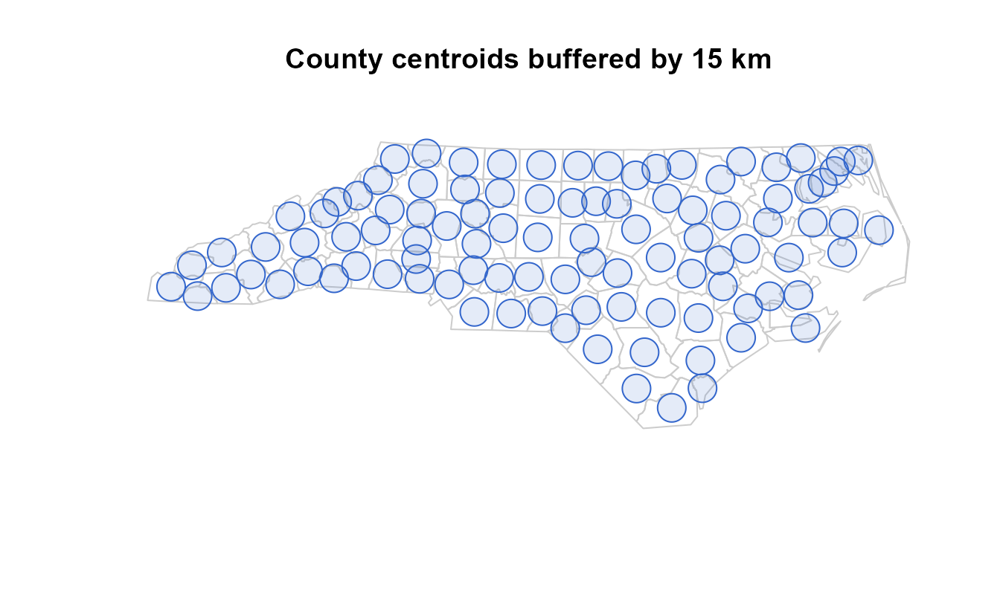
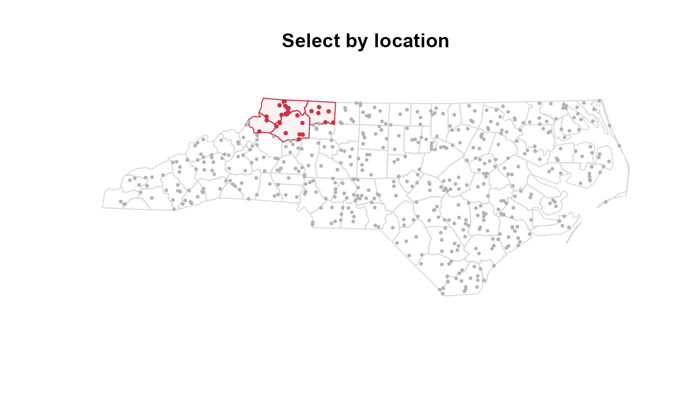
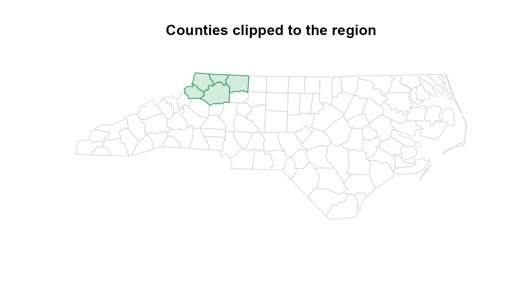
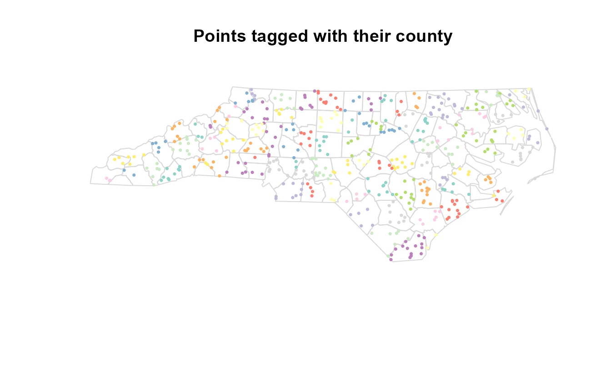
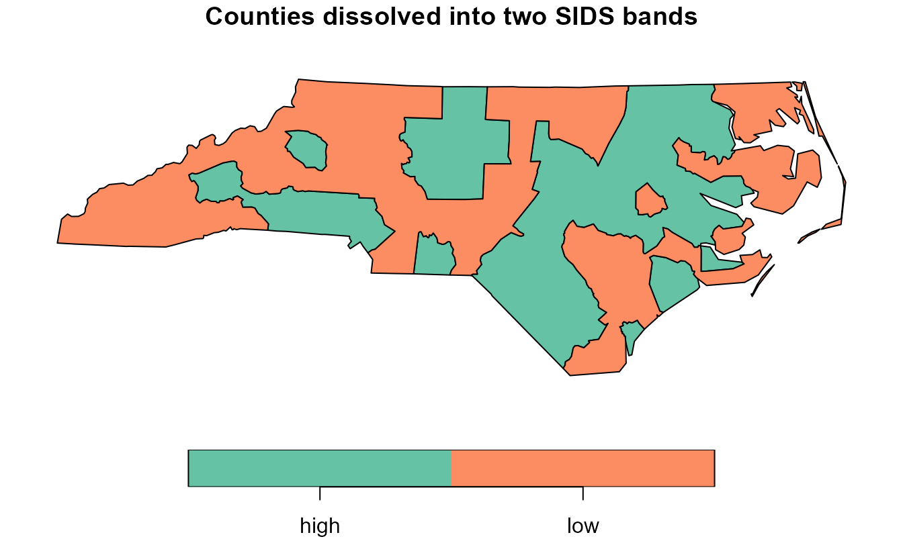
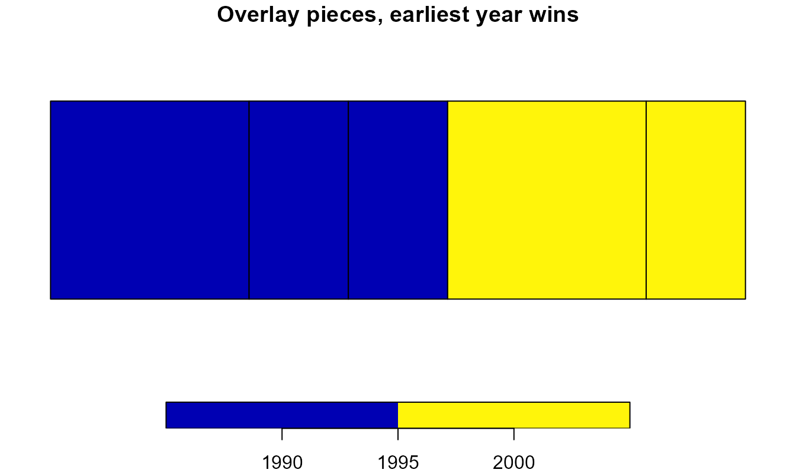

# Streaming spatial operations

This vignette is the hands-on companion to [Out-of-core GIS with
vectra](https://gillescolling.com/vectra/articles/spatial.md). That
article lays out the cost model; this one runs the streaming vector
verbs end to end on a real layer, so every block below is code you can
execute and check. It needs the optional
[sf](https://r-spatial.github.io/sf/) package, which supplies the
geometry engine vectra streams around.

``` r

library(vectra)
library(sf)
```

## The problem

A desktop GIS holds one layer in memory, runs a tool, and writes the
result. That model breaks the moment the working layer is bigger than
RAM: a national occurrence set, a continental road network, every parcel
in a country. The geometry alone runs to tens of gigabytes before any
operation touches it.

vectra keeps the same toolbox but changes what stays resident. A query
is pulled through the C engine in fixed-size batches; each spatial step
works on the batch in front of it and spills the transformed batch back
to disk as a fresh lazy node. Peak memory is one batch plus whatever
small layer the step compares against, so a billion-row layer flows past
a fixed budget. The verbs in this vignette are that streaming envelope:
[`spatial_map()`](https://gillescolling.com/vectra/reference/spatial_map.md),
[`spatial_filter()`](https://gillescolling.com/vectra/reference/spatial_filter.md),
[`spatial_clip()`](https://gillescolling.com/vectra/reference/spatial_clip.md),
[`spatial_join()`](https://gillescolling.com/vectra/reference/spatial_join.md),
[`spatial_dissolve()`](https://gillescolling.com/vectra/reference/spatial_dissolve.md),
[`spatial_overlay()`](https://gillescolling.com/vectra/reference/spatial_overlay.md),
and
[`rasterize()`](https://gillescolling.com/vectra/reference/rasterize.md).

## How geometry travels

vectra has no geometry type. A geometry rides through the engine as
hex-encoded WKB in an ordinary string column, and the coordinate
reference system is carried on the returned node rather than written
into the `.vtr` file. Topology stays with sf and the GEOS library it
links: vectra contributes the streaming, the spill machinery, and a
native fast path, not the geometry algorithms.

One streamed step is a loop. Pull a batch, decode its WKB column into an
`sf` object, run the operation, encode the result back into a WKB string
column, and append it to a run-file. When the loop finishes, the
run-files become a single lazy node you can carry on querying. The
memory a run holds is

    peak  =  one batch  +  the resident comparison layer

independent of how many batches stream past. The batch size for the
spill is `flush_rows` (default 500,000 transformed rows); the resident
layer is the small `y` a join or filter tests against.

To make the examples concrete, load the North Carolina counties shipped
with sf and project them to the state plane in metres. Projecting
matters here: in a planar CRS distances, areas, and buffers are
Euclidean, and the recognised operations run natively on the GEOS C API
straight off the WKB column instead of decoding each batch back to `sf`.

``` r

nc <- st_read(system.file("shape/nc.shp", package = "sf"), quiet = TRUE)
nc <- st_transform(nc, 32119)        # NAD83 / North Carolina, metres
crs_nc <- st_crs(nc)
nrow(nc)
#> [1] 100
```

Write the polygons to a `.vtr` file with their geometry as a hex-WKB
column. This is the shape every streamed layer takes: attribute columns
plus one string column of WKB. In a real out-of-core workflow this file
would be written once from a large source and reused; here it is 100
counties standing in for the billion-row case.

``` r

f_poly <- tempfile(fileext = ".vtr")
write_vtr(data.frame(
  NAME  = nc$NAME,
  BIR74 = nc$BIR74,
  SID74 = nc$SID74,
  geometry = st_as_binary(st_geometry(nc), hex = TRUE)
), f_poly)
```

`tbl(f_poly)` now opens a lazy node over that file. Nothing is read
until a verb pulls it. Two functions bring a streamed result back to R:
[`collect()`](https://gillescolling.com/vectra/reference/collect.md)
returns the underlying data.frame, geometry still a WKB string;
[`collect_sf()`](https://gillescolling.com/vectra/reference/collect_sf.md)
decodes that string and reattaches the node’s CRS, giving an ordinary
`sf` object ready to plot or hand to any sf function.

## Per-feature transforms with spatial_map

The widest door is
[`spatial_map()`](https://gillescolling.com/vectra/reference/spatial_map.md):
apply any per-feature sf operation to a streamed layer one batch at a
time. Buffering, simplifying, computing centroids, reprojecting,
extracting coordinates, measuring area. The function you pass takes one
`sf` batch and returns an `sf` object, an `sfc`, or a plain data.frame.
The active geometry of the return becomes the streamed geometry.

Buffer every county centroid by 15 km. The first step builds a centroid
layer on disk, the second streams a buffer over it.

``` r

cent <- tempfile(fileext = ".vtr")
write_vtr(data.frame(
  NAME = nc$NAME,
  geometry = st_as_binary(st_centroid(st_geometry(nc)), hex = TRUE)
), cent)

buffered <- tbl(cent) |>
  spatial_map(~ st_buffer(.x, 15000), crs = crs_nc)
buffered
#> vectra query node
#> Columns (2):
#>   NAME <string>
#>   geometry <string>
```

`buffered` is a lazy node, not a materialized layer: the buffer has not
run yet.
[`collect_sf()`](https://gillescolling.com/vectra/reference/collect_sf.md)
pulls it through and decodes the geometry.

``` r

b_sf <- collect_sf(buffered)
plot(st_geometry(nc), border = "grey80", col = NA,
     main = "County centroids buffered by 15 km")
plot(st_geometry(b_sf), border = "#3366cc", col = "#3366cc22", add = TRUE)
```



The formula syntax (`~ st_buffer(.x, 15000)`) is rlang’s: `.x` is the
batch. A named function works identically and is clearer for anything
longer than one call. The return can also be a plain data.frame rather
than a geometry, which turns the spatial step into a streamed
feature-summary with the geometry dropped. That is the way to compute
per-feature area over a layer too large to hold whole.

``` r

areas <- tbl(f_poly) |>
  spatial_map(~ data.frame(NAME = .x$NAME,
                           area_km2 = as.numeric(st_area(.x)) / 1e6),
              crs = crs_nc)
head(collect(areas))
#>          NAME  area_km2
#> 1        Ashe 1137.5901
#> 2   Alleghany  611.1970
#> 3       Surry 1423.7288
#> 4   Currituck  694.6611
#> 5 Northampton 1520.9918
#> 6    Hertford  967.8553
```

Because the result is a node, it chains. A buffer feeding a filter
feeding a join is three streamed steps, each spilling to its own
run-files, with the CRS carried forward so you state it once.
`flush_rows` controls the spill batch: raise it for fewer, larger
temporary files when rows are small, lower it when a single feature’s
geometry is heavy. The default of 500,000 suits point and small-polygon
work.

## Smooth geometry with spatial_smooth

[`spatial_smooth()`](https://gillescolling.com/vectra/reference/spatial_smooth.md)
rounds the corners of every line and polygon by Chaikin corner-cutting,
one batch at a time. Each pass replaces a vertex with two points along
its adjacent edges, so sharp angles become a smooth curve; more
`iterations` give a smoother result with more vertices. It is computed
directly on the coordinates with no GEOS call, and open lines keep their
endpoints.

``` r

zig <- st_linestring(rbind(c(0, 0), c(1, 1), c(2, 0), c(3, 1), c(4, 0)))
f_zig <- tempfile(fileext = ".vtr")
write_vtr(data.frame(
  id = 1L, geometry = st_as_binary(st_sfc(zig), hex = TRUE)), f_zig)

tbl(f_zig) |> spatial_smooth(iterations = 3) |> collect_sf()
#> Simple feature collection with 1 feature and 1 field
#> Geometry type: LINESTRING
#> Dimension:     XY
#> Bounding box:  xmin: 0 ymin: 0 xmax: 4 ymax: 0.75
#> CRS:           NA
#>   id                       geometry
#> 1  1 LINESTRING (0 0, 0.015625 0...
unlink(f_zig)
```

## Select by location with spatial_filter

The most-used vector tool keeps the features standing in a spatial
relation to another layer: points inside a study region, parcels
touching a road, patches within a buffer of the coast.
[`spatial_filter()`](https://gillescolling.com/vectra/reference/spatial_filter.md)
streams the large layer and tests each batch against a small resident
layer with an sf predicate, keeping or dropping whole features. It is
the spatial counterpart to
[`semi_join()`](https://gillescolling.com/vectra/reference/left_join.md):
rows are filtered, never duplicated, and no columns are added, so the
output carries the input schema unchanged.

Sample 500 points across the state and store them as plain x/y columns.
Point input as coordinate columns is the headline case and the fully
sf-free path: each point is built in C and matched against the resident
layer’s spatial index with no per-batch round-trip through sf.

``` r

set.seed(1)
pts <- st_coordinates(st_sample(st_union(nc), 500))
fp <- tempfile(fileext = ".vtr")
write_vtr(data.frame(id = seq_len(nrow(pts)), x = pts[, 1], y = pts[, 2]), fp)
```

Keep the points falling inside a five-county region in the northwest.

``` r

region <- nc[nc$NAME %in% c("Ashe", "Alleghany", "Surry", "Wilkes", "Watauga"),
             "NAME"]

keep_xy <- tbl(fp) |>
  spatial_filter(region, coords = c("x", "y"), crs = crs_nc) |>
  collect()
nrow(keep_xy)
#> [1] 25
```

Twenty-five of the 500 points land in the region. Plot the kept points
against the dropped ones.

``` r

plot(st_geometry(nc), border = "grey85", col = NA, main = "Select by location")
plot(st_geometry(region), border = "#cc3344", col = "#cc334411", add = TRUE)
points(pts, pch = 16, cex = 0.5, col = "grey70")
points(keep_xy$x, keep_xy$y, pch = 16, cex = 0.6, col = "#cc3344")
```



`negate = TRUE` inverts the test, keeping the 475 points outside the
region. A different `predicate` changes the relation: `st_within`,
`st_covered_by`, `st_touches`, `st_crosses`, and the rest of the sf
binary predicates are all accepted. `st_is_within_distance` takes its
radius through `dist`, in CRS units, and keeps every feature within that
distance of the layer.

``` r

near <- tbl(fp) |>
  spatial_filter(region, predicate = st_is_within_distance,
                 coords = c("x", "y"), crs = crs_nc, dist = 30000)
nrow(collect(near))
#> [1] 60
```

Sixty points sit within 30 km of the region, more than the 25 strictly
inside. For the recognised predicates on planar data the test runs in C
off the WKB column or the raw coordinates; an unrecognised predicate,
geographic data with spherical geometry switched on, or an extra
predicate argument falls back to the per-batch sf loop, which preserves
sf’s exact semantics at the cost of decoding each batch.

## Cut geometry with spatial_clip

[`spatial_filter()`](https://gillescolling.com/vectra/reference/spatial_filter.md)
keeps or drops whole features;
[`spatial_clip()`](https://gillescolling.com/vectra/reference/spatial_clip.md)
cuts their geometry along a mask. Clipping intersects each batch with
the mask and keeps the part inside it, the streamed equivalent of
[`st_intersection()`](https://r-spatial.github.io/sf/reference/geos_binary_ops.html)
against a fixed boundary. `erase = TRUE` keeps the part outside instead.

``` r

mask_region <- st_union(st_geometry(region))

clipped <- tbl(f_poly) |> spatial_clip(mask_region, crs = crs_nc)
c_sf <- collect_sf(clipped)
nrow(c_sf)
#> [1] 12
```

Twelve counties have area inside the region’s bounding shape, and each
comes back trimmed to the part that overlaps it. Plot the clipped
slivers over the full state.

``` r

plot(st_geometry(nc), border = "grey85", col = NA,
     main = "Counties clipped to the region")
plot(st_geometry(c_sf), border = "#2a9d5c", col = "#2a9d5c33", add = TRUE)
```



The mask is unioned once into a single resident geometry, then each
batch is cut against it in C. As with the join and filter, the cut runs
natively on the WKB column for planar data and through
[`st_intersection()`](https://r-spatial.github.io/sf/reference/geos_binary_ops.html)
/
[`st_difference()`](https://r-spatial.github.io/sf/reference/geos_binary_ops.html)
for the geographic-with-s2 and coordinate-assembled cases. Erase
reverses the keep:
`tbl(f_poly) |> spatial_clip(mask_region, erase = TRUE)` returns the 95
counties with any area outside the region, each trimmed to that outside
part.

## Split geometry with spatial_split

[`spatial_split()`](https://gillescolling.com/vectra/reference/spatial_split.md)
cuts each feature against a small resident `blade` layer, the QGIS
“split with lines”. A polygon is divided into the faces the blade carves
out, a line into the arcs between crossings, and each piece is emitted
as its own row with the source attributes copied. A feature the blade
does not cross passes through whole. With `extract = "points"` the verb
returns the crossing points instead.

``` r

square <- st_polygon(list(rbind(c(0, 0), c(4, 0), c(4, 4), c(0, 4), c(0, 0))))
blade  <- st_sfc(st_linestring(rbind(c(2, -1), c(2, 5))))

f_sq <- tempfile(fileext = ".vtr")
write_vtr(data.frame(
  id = 1L, geometry = st_as_binary(st_sfc(square), hex = TRUE)), f_sq)

tbl(f_sq) |> spatial_split(blade) |> collect_sf()
#> Simple feature collection with 2 features and 1 field
#> Geometry type: POLYGON
#> Dimension:     XY
#> Bounding box:  xmin: 0 ymin: 0 xmax: 4 ymax: 4
#> CRS:           NA
#>   id                       geometry
#> 1  1 POLYGON ((2 0, 0 0, 0 4, 2 ...
#> 2  1 POLYGON ((2 4, 4 4, 4 0, 2 ...
unlink(f_sq)
```

## Tag features with spatial_join

To attach a layer’s attributes rather than filter or cut,
[`spatial_join()`](https://gillescolling.com/vectra/reference/spatial_join.md)
streams the large left side and joins each batch against a small
resident right side. The dominant workload is tagging a huge point set
with the polygon it falls in: which county each occurrence sits in,
which census tract each address belongs to. The billion-row left stream
never materializes while the polygon layer stays in RAM.

``` r

tagged <- tbl(fp) |>
  spatial_join(nc["NAME"], coords = c("x", "y"), crs = crs_nc)
tdf <- collect(tagged)
head(tdf[, c("id", "NAME")])
#>   id       NAME
#> 1  1       Hoke
#> 2  2 Pasquotank
#> 3  3    Tyrrell
#> 4  4   Johnston
#> 5  5 Cumberland
#> 6  6  Brunswick
```

Every point now carries the `NAME` of its county. The default predicate
is `st_intersects` and the default is a left join, so an unmatched left
row is kept once with NA in the right columns; `left = FALSE` drops the
unmatched rows for an inner join. Colour the points by the county they
were tagged with.

``` r

tagged_sf <- st_as_sf(tdf, coords = c("x", "y"), crs = crs_nc)
plot(st_geometry(nc), border = "grey85", col = NA,
     main = "Points tagged with their county")
plot(tagged_sf["NAME"], pch = 16, cex = 0.5, add = TRUE)
```



Columns present on both sides are disambiguated with `suffix` (default
`c(".x", ".y")`), exactly as
[`st_join()`](https://r-spatial.github.io/sf/reference/st_join.html)
does. A different `join` predicate changes the relation;
`st_nearest_feature` finds the closest right feature to each left one,
which is how you snap points to the nearest road or station.

``` r

ncent <- st_sf(NAME = nc$NAME, geometry = st_centroid(st_geometry(nc)))
nearest <- tbl(fp) |>
  spatial_join(ncent, join = st_nearest_feature,
               coords = c("x", "y"), crs = crs_nc)
nrow(collect(nearest))
#> [1] 500
```

### When both sides are larger than RAM

The resident-`y` path assumes the right side fits in memory. When it
does not, pass `partition = grid(cellsize)` and a streamed `vectra_node`
as `y`. Both inputs are binned to a uniform grid and joined one shard at
a time, so neither side is ever fully resident. A coordinate maps to the
cell

    cell  =  floor( (coord - origin) / cellsize )

per axis. Each left feature is assigned to the single cell of its
reference point; each right feature is replicated to every cell its
bounding box overlaps. A left row is therefore emitted exactly once, and
the result equals the resident join for point left geometry.

``` r

g_poly <- tempfile(fileext = ".vtr")
write_vtr(data.frame(
  NAME = nc$NAME,
  geometry = st_as_binary(st_geometry(nc), hex = TRUE)
), g_poly)

tagged2 <- tbl(fp) |>
  spatial_join(tbl(g_poly), coords = c("x", "y"), crs = crs_nc,
               partition = grid(80000))
t2 <- collect(tagged2)
sum(!is.na(t2$NAME))
#> [1] 500
```

All 500 points are tagged, matching the resident join. The `cellsize` is
the one tuning knob: large enough that one cell’s features fit in
memory, small enough that the shards stay balanced. For point-in-polygon
tagging any cell larger than the polygons works; for an
extended-on-extended join choose it larger than the left features. The
nearest-feature predicate is not local to one cell, so under `partition`
a left point searches its own cell and the eight around it; set
`cellsize` at least as large as the largest expected nearest distance.

### Same answer as resident sf

Streaming changes the memory profile, not the result. The streamed join
returns exactly what
[`st_join()`](https://r-spatial.github.io/sf/reference/st_join.html)
returns on the whole layer held in memory, feature for feature. Run both
on the 500-point set and compare.

``` r

streamed <- collect(
  tbl(fp) |> spatial_join(nc["NAME"], coords = c("x", "y"), crs = crs_nc))

resident <- st_join(
  st_as_sf(collect(tbl(fp)), coords = c("x", "y"), crs = crs_nc, remove = FALSE),
  nc["NAME"], join = st_intersects)

all.equal(streamed$NAME[order(streamed$id)],
          resident$NAME[order(resident$id)])
#> [1] TRUE
```

The county tags match for every point. The equality is the contract: a
streamed verb is the resident sf call run batch by batch, so the choice
between them is a memory decision, not an accuracy trade-off.

### At scale

The point of streaming shows when the layer stops fitting in memory.
Scatter 200,000 points across the state’s bounding box and filter them
to the five-county region. Only one batch is resident at a time, so the
same code that ran on 500 points runs on 200,000 with a flat memory
profile.

``` r

set.seed(42)
bb <- st_bbox(nc)
n_big <- 2e5
big <- data.frame(id = seq_len(n_big),
                  x = runif(n_big, bb["xmin"], bb["xmax"]),
                  y = runif(n_big, bb["ymin"], bb["ymax"]))
fbig <- tempfile(fileext = ".vtr")
write_vtr(big, fbig)

kept <- tbl(fbig) |>
  spatial_filter(region, coords = c("x", "y"), crs = crs_nc) |>
  collect()
nrow(kept)
#> [1] 4759
```

A few thousand of the 200,000 land in the five counties. At a billion
points the file would be larger but the resident set would not grow: the
engine still pulls one batch, tests it in C against the region’s spatial
index, and moves on. That is the whole proposition. The operation that a
desktop GIS can only run on a layer it can open is the same operation,
run past a fixed memory budget.

## Nearest features with spatial_knn

Where
[`spatial_join()`](https://gillescolling.com/vectra/reference/spatial_join.md)
attaches the single nearest feature,
[`spatial_knn()`](https://gillescolling.com/vectra/reference/spatial_knn.md)
returns the `k` nearest features per streamed point, one row per pair,
each with the rank (1 is nearest) and the distance. The candidate layer
`y` is held resident while the points stream.

``` r

towns <- suppressWarnings(st_centroid(st_geometry(nc)))[1:5]
towns <- st_sf(town = nc$NAME[1:5], geometry = towns)

set.seed(1)
pts <- suppressWarnings(st_coordinates(st_sample(nc, 100)))
f_pts <- tempfile(fileext = ".vtr")
write_vtr(data.frame(id = seq_len(nrow(pts)), x = pts[, 1], y = pts[, 2]), f_pts)

tbl(f_pts) |>
  spatial_knn(towns, k = 2, coords = c("x", "y"), crs = crs_nc, y_id = "town") |>
  collect() |> head()
#>   id        x         y rank    neighbor distance
#> 1  1 585944.2 193988.16    1       Surry 163726.1
#> 2  1 585944.2 193988.16    2 Northampton 195894.6
#> 3  2 656888.0  95932.95    1 Northampton 223065.3
#> 4  2 656888.0  95932.95    2       Surry 282285.8
#> 5  3 631329.1  81102.29    1 Northampton 247961.5
#> 6  3 631329.1  81102.29    2       Surry 276346.2
#>                                     geometry
#> 1 010100000054a8e56bb0e1214162e33d4321ae0741
#> 2 010100000054a8e56bb0e1214162e33d4321ae0741
#> 3 0101000000bcf0a5feef0b244177a04720cf6bf740
#> 4 0101000000bcf0a5feef0b244177a04720cf6bf740
#> 5 01010000007f67de2442442341cd80edace4ccf340
#> 6 01010000007f67de2442442341cd80edace4ccf340
unlink(f_pts)
```

## Merge geometries with spatial_dissolve

Dissolve unions the geometries within each group into one feature, the
GIS “Dissolve” tool: counties into states, parcels into ownership
blocks. Unlike the per-batch verbs, it needs every geometry of a group
together to union them, so it rides a different tier. The input is
spilled once and routed into one disjoint shard per group in a single
bounded pass; each shard is then read back and unioned. Peak memory is
the routing budget during the pass, then one group’s geometries while
that group unions. Partition on a key whose groups fit in memory.

Split the counties into two bands by their 1974 SIDS count and merge
each band into a single feature, summing births along the way.

``` r

nc$band <- ifelse(nc$SID74 > 5, "high", "low")
fb <- tempfile(fileext = ".vtr")
write_vtr(data.frame(
  band = nc$band, BIR74 = nc$BIR74,
  geometry = st_as_binary(st_geometry(nc), hex = TRUE)
), fb)

merged <- tbl(fb) |>
  spatial_dissolve(by = "band", crs = crs_nc,
                   .fun = list(births = function(d) sum(d$BIR74)))
m_sf <- collect_sf(merged)
m_sf
#> Simple feature collection with 2 features and 2 fields
#> Geometry type: MULTIPOLYGON
#> Dimension:     XY
#> Bounding box:  xmin: 123829.8 ymin: 14740.06 xmax: 930518.6 ymax: 318255.5
#> Projected CRS: NAD83 / North Carolina
#>   band births                       geometry
#> 1 high 227613 MULTIPOLYGON (((568618.4 96...
#> 2  low 102349 MULTIPOLYGON (((281152.8 19...
```

Two features come back, one per band, each carrying the summed `births`
of its counties. The `.fun` argument is a named list of summaries; each
function takes the group’s data.frame and returns one value, and the
list name becomes the output column. Plot the two bands.

``` r

plot(m_sf["band"], main = "Counties dissolved into two SIDS bands")
```



With no `by`, the whole layer dissolves into one feature, which is the
fast way to compute a layer’s outline out of core. On planar data each
group is unioned natively off the WKB column; geographic data with s2
on, or an extra
[`st_union()`](https://r-spatial.github.io/sf/reference/geos_combine.html)
argument such as `is_coverage = TRUE`, unions through sf instead.

## Split overlaps apart with spatial_overlay

Dissolve merges overlapping geometry; overlay splits it.
[`spatial_overlay()`](https://gillescolling.com/vectra/reference/spatial_overlay.md)
takes a polygon layer that overlaps itself and cuts it along every
overlap into disjoint pieces, returning one row per piece per covering
polygon. Where `k` polygons overlap, that piece appears `k` times, each
row carrying one source polygon’s attributes. This is the operation a
GIS exposes as “Union (single layer)”: the overlap is retained once per
contributing feature rather than dissolved away. It answers questions
like “which protected areas, designated in which years, cover this exact
patch of sea”.

Three overlapping squares designated in different years make the
smallest meaningful example.

``` r

sq <- function(a, b) st_polygon(list(rbind(
  c(a, 0), c(b, 0), c(b, 1), c(a, 1), c(a, 0))))
polys <- st_sf(year = c(1990L, 2010L, 2000L),
               geometry = st_sfc(sq(0, 2), sq(1, 3), sq(1.5, 3.5)))

pieces <- collect_sf(spatial_overlay(polys))
nrow(pieces)
#> [1] 9
length(unique(pieces$piece_id))
#> [1] 5
```

The three squares decompose into five disjoint pieces, returned as nine
rows because the overlapping pieces are repeated once per covering
square. The `piece_id` column keys the pieces: rows sharing an id are
the same patch of ground seen from different source polygons. Resolve
the duplication with a grouped slice. Earliest designation year wins:

``` r

first <- spatial_overlay(polys) |>
  group_by(piece_id) |>
  slice_min(year, n = 1, with_ties = FALSE) |>
  collect_sf()
nrow(first)
#> [1] 5

plot(first["year"], main = "Overlay pieces, earliest year wins")
```



Five pieces remain, one per disjoint patch, each labelled with the
earliest year that covers it. Swapping `slice_min` for `slice_max` gives
the latest; any grouped reduction works, because the pieces are an
ordinary streamed node by this point.

Three properties make the overlay trustworthy on real data. First,
correctness is checked, not assumed: for a valid decomposition the piece
areas covering an input must sum to that input’s area, and the engine
verifies this invariant per batch, warning if coverage drifts past a
relative `1e-4` rather than returning silently wrong. Second, memory is
bounded by tiling: a connected cluster of many large overlapping
polygons can node into far more linework than the input, so clusters too
large for the budget are tiled over their own extent and clipped, with
each feature cleaned exactly once. Third, the snapping grid is explicit:
coordinates are snapped to a grid derived from their magnitude so the
near-duplicate boundaries that overlapping polygons share coincide,
which is what keeps the pieces disjoint instead of leaving sliver faces.

Unlike the other verbs,
[`spatial_overlay()`](https://gillescolling.com/vectra/reference/spatial_overlay.md)
takes a resident `sf` object, not a lazy node: building the overlap
graph needs the geometries in memory. The exploded result, typically
several times larger than the input, is what streams to disk.
`mem_limit` caps the peak working set and `threads` sets the parallel
overlay width; raise both for speed on a big machine, lower `mem_limit`
for tighter memory.

### A second layer

Passing a second layer `y` nodes two layers into one planar partition
and carries the attributes of the covering `x`-record and `y`-record
onto each piece. A `how` argument selects which pieces to keep:
`"intersection"` (covered by both, the default), `"union"` (every piece
of either, the absent side filled with `NA`), `"identity"` (all of `x`
split by `y`), or `"symdiff"` (pieces in exactly one layer).

``` r

zones <- st_sf(zone = c("A", "B"),
               geometry = st_sfc(sq(0, 1.5), sq(1.5, 3)))

inter <- spatial_overlay(polys, zones, how = "intersection") |> collect_sf()
inter
#> Simple feature collection with 8 features and 3 fields
#> Geometry type: POLYGON
#> Dimension:     XY
#> Bounding box:  xmin: 0 ymin: 0 xmax: 3 ymax: 1
#> CRS:           NA
#>   year zone piece_id                       geometry
#> 1 1990    A        1 POLYGON ((0 1, 1 1, 1 0, 0 ...
#> 2 1990    A        2 POLYGON ((1 1, 1.5 1, 1.5 0...
#> 3 2010    A        2 POLYGON ((1 1, 1.5 1, 1.5 0...
#> 4 1990    B        3 POLYGON ((1.5 1, 2 1, 2 0, ...
#> 5 2000    B        3 POLYGON ((1.5 1, 2 1, 2 0, ...
#> 6 2010    B        3 POLYGON ((1.5 1, 2 1, 2 0, ...
#> 7 2010    B        4 POLYGON ((2 0, 2 1, 3 1, 3 ...
#> 8 2000    B        4 POLYGON ((2 0, 2 1, 3 1, 3 ...
```

Each piece now carries both its `year` (from the squares) and its `zone`
(from the zone layer). `vars_y` narrows the carried `y` columns, and a
name shared with an `x` column is disambiguated with a `.x` / `.y`
suffix. A file-path `y` is read in batches with `layer_y` / `query_y`,
the same way `x` is.

## Materializing and round-tripping

Three exits bring a streamed result out.
[`collect()`](https://gillescolling.com/vectra/reference/collect.md)
returns the data.frame with geometry still a WKB string, useful when the
next step is a non-spatial verb or another `.vtr` write.
[`collect_sf()`](https://gillescolling.com/vectra/reference/collect_sf.md)
decodes the WKB and reattaches the node’s CRS, giving an `sf` object.
[`write_vtr()`](https://gillescolling.com/vectra/reference/write_vtr.md)
on a node streams the result straight to a new `.vtr` file without ever
holding it whole, so a multi-step spatial pipeline can land its output
on disk under the same fixed memory budget it ran in.

``` r

out <- tempfile(fileext = ".vtr")
tbl(fp) |>
  spatial_filter(region, coords = c("x", "y"), crs = crs_nc) |>
  write_vtr(out)
nrow(collect(tbl(out)))
#> [1] 25
```

The CRS lives on the node, not in the file. A pipeline that opens
projected data, maps, filters, and joins keeps the projection because
each verb carries it forward; you state `crs =` once at the first step
that needs it, or let it inherit from the upstream node. The `.vtr` file
itself stores only the WKB bytes, so reopening a written file and
calling
[`collect_sf()`](https://gillescolling.com/vectra/reference/collect_sf.md)
needs the CRS supplied again if you want it labelled.

## The cost model

Each verb states what it holds resident, so the toolbox reads as a cost
model. Three tiers cover everything here.

| Tier | Verbs | Resident set |
|----|----|----|
| Monoid fold | `spatial_map`, `spatial_filter`, `spatial_clip`, `rasterize` | one batch + small `y` |
| Partition | `spatial_dissolve`, partitioned `spatial_join` | routing budget, then one shard |
| All-to-all | `spatial_overlay` | one overlap cluster (tiled) |

The fold tier is the cheapest: one batch at a time, no spill, memory
flat across the whole stream. The partition tier spills the input once
and processes it one group or shard at a time, so its peak is set by the
largest group rather than the whole layer. The all-to-all tier is
inherently resident because the operation is global, and the overlay
bounds it by tiling overlap clusters. Operations that are global by
nature and not tiled, such as Voronoi diagrams, Delaunay triangulation,
convex hulls, and neighbour graphs, are not streamed at all:
[`collect_sf()`](https://gillescolling.com/vectra/reference/collect_sf.md)
the layer and run sf or terra on it.

A second axis is whether a step runs natively or through sf. The
recognised predicates and operations run in C straight off the WKB
column when the data is planar, which means projected, or geographic
with spherical geometry off, or of unknown CRS. Geographic data with
[`sf::sf_use_s2()`](https://r-spatial.github.io/sf/reference/s2.html) on
keeps the spherical sf path so the answer matches sf exactly. The native
path parses the resident layer once into a spatial index and tests each
batch in C with no decode; the fallback decodes each batch to `sf`. For
the large planar workloads vectra targets, the native path is the common
case, which is why the examples project up front.

Four options tune the machinery:

- `vectra.spatial_flush` (default 500,000): rows buffered before a spill
  flush.

- `vectra.partition_budget`: rows held while routing a dissolve or
  partitioned join before flushing shards.

- `vectra.overlay_mem_limit` (default 2 GB): the overlay’s peak
  working-set budget.

- `vectra.overlay_threads` and `vectra.spatial_threads`: worker counts
  for the overlay and the per-batch GEOS loops.

## Practical guidance

A few rules of thumb, with the numbers that drive them.

**Project before you stream.** A projected CRS puts the recognised verbs
on the native GEOS path and makes distances and areas Euclidean.
Geographic data with s2 on works but decodes every batch to sf and
computes on the sphere, which is correct but slower; reach for it only
when spherical accuracy over large extents matters more than throughput.

**Size the join grid to the data, not the machine.** For
point-in-polygon tagging set `grid(cellsize)` to anything larger than
your polygons; the join is exact for point left geometry at any such
size. For an extended-on-extended join make `cellsize` larger than the
left features. For a partitioned nearest-feature join make it at least
the largest expected nearest distance, because the search only reaches
the eight neighbouring cells.

**Match `flush_rows` to feature weight.** The 500,000 default suits
points and small polygons. For heavy geometry, dense coastlines,
detailed admin boundaries, lower it so a spill batch is a workable size;
for millions of tiny point rows, raise it to cut the number of temporary
files.

**Partition dissolve on a key whose groups fit.** Dissolve holds one
group’s geometry while it unions. Dissolving a country into one outline
is fine; grouping by a key with a single enormous group is not, because
that group must be resident to union. Split the key finer if a group
blows the budget.

**Trust the overlay’s coverage warning.** If
[`spatial_overlay()`](https://gillescolling.com/vectra/reference/spatial_overlay.md)
warns that coverage drifted past `1e-4`, the named input features are
finer than the snapping grid or invalid after it. Pass a smaller
`grid =` for fine geometry, or inspect the `coverage_offenders`
attribute on the result for the worst rows. A clean run means the pieces
reconstruct the inputs exactly.

When the verbs map to tiers and resident sets, the choice of tool is a
memory decision:

| Need                    | Verb                       | Holds resident       |
|-------------------------|----------------------------|----------------------|
| Per-feature transform   | `spatial_map`              | one batch            |
| Keep / drop by location | `spatial_filter`           | one batch + locator  |
| Cut geometry to a mask  | `spatial_clip`             | one batch + mask     |
| Tag with attributes     | `spatial_join`             | one batch + polygons |
| Tag, both sides huge    | `spatial_join(partition=)` | one grid shard       |
| Merge by group          | `spatial_dissolve`         | one group            |
| Split self-overlaps     | `spatial_overlay`          | one overlap cluster  |

**When not to stream.** For a layer that already fits in memory, sf is
simpler and faster: there is no gain in spilling 10,000 features through
run-files when
[`st_join()`](https://r-spatial.github.io/sf/reference/st_join.html)
runs in a blink. Streaming earns its overhead when the layer is larger
than RAM, or when a step in a longer pipeline would otherwise force a
full materialization. For genuinely global operations, Voronoi,
Delaunay, hulls, neighbour graphs, there is nothing to stream: collect
the layer and run the resident tool. The streaming envelope covers the
operations whose memory can be bounded, and the cost model names the
ones it cannot.

## Where to go next

- [Out-of-core GIS with
  vectra](https://gillescolling.com/vectra/articles/spatial.md) for the
  cost model and the raster half of the toolbox:
  [`zonal()`](https://gillescolling.com/vectra/reference/zonal.md),
  [`focal()`](https://gillescolling.com/vectra/reference/focal.md),
  [`terrain()`](https://gillescolling.com/vectra/reference/terrain.md),
  [`warp()`](https://gillescolling.com/vectra/reference/warp.md),
  [`polygonize()`](https://gillescolling.com/vectra/reference/polygonize.md),
  [`contours()`](https://gillescolling.com/vectra/reference/contours.md),
  [`proximity()`](https://gillescolling.com/vectra/reference/proximity.md).
- [Larger-than-RAM
  strategy](https://gillescolling.com/vectra/articles/large-data.md) for
  the spill and partition tiers the spatial verbs reuse.
- [Species distribution
  modelling](https://gillescolling.com/vectra/articles/sdm.md) for an
  end-to-end ecological workflow built on these verbs.
- The function reference for every spatial verb and its arguments.
  \`\`\`
